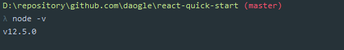
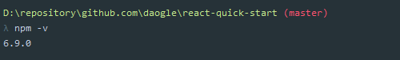
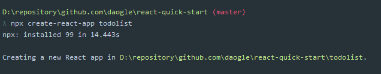
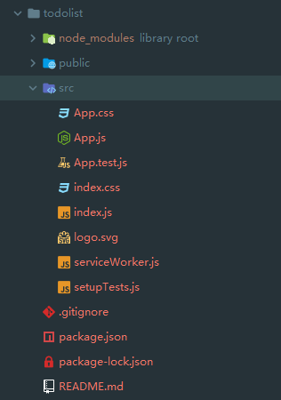

# React Quick Start

### 第1章 React简介及基础语法

##### 1-1 React 简介

React 是用于构建用户界面的 JavaScript 库。它起源于 Facebook 的内部项目，因为该公司对市场上所有 JavaScript MVC 框架都不满意，就决定自己写一套，用来架设 <a href="https://instagram.com/" target="_blank">Instagram</a> 的网站。做出来以后，发现这套东西很好用，就在2013年5月<a href="http://facebook.github.io/react/blog/2013/06/05/why-react.html" target="_blank">开源</a>了。

##### 1-2 React开发环境搭建

- Nodejs 安装

浏览器访问：https://nodejs.org/zh-cn，建议下载安装比较稳定的 LTS 版本。

- 检查 node 命令

```
node -v
```



- 检查 npm 命令

```
npm -v
```



- 创建 React 项目

```
npx create-react-app todolist
```



##### 1-3 项目工程代码精简

默认的项目结构：



精简之后的目录结构：


##### 1-4 什么是组件？
##### 1-5 简单的JSX语法

### 第2章 React实战

##### 2-1 编写 TodoList 功能
##### 2-2 完成新增列表项的功能
##### 2-3 实现列表项的删除功能

### 第3章 React组件与通信

##### 3-1 React中组件的拆分
##### 3-2 子组件向父组件传值的方式
##### 3-3 代码优化

### 第4章 React中的样式布局

##### 4-1 React项目中如何使用CSS样式修饰